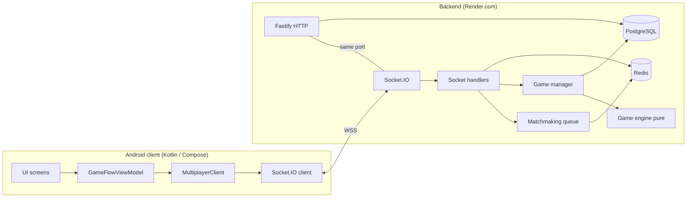
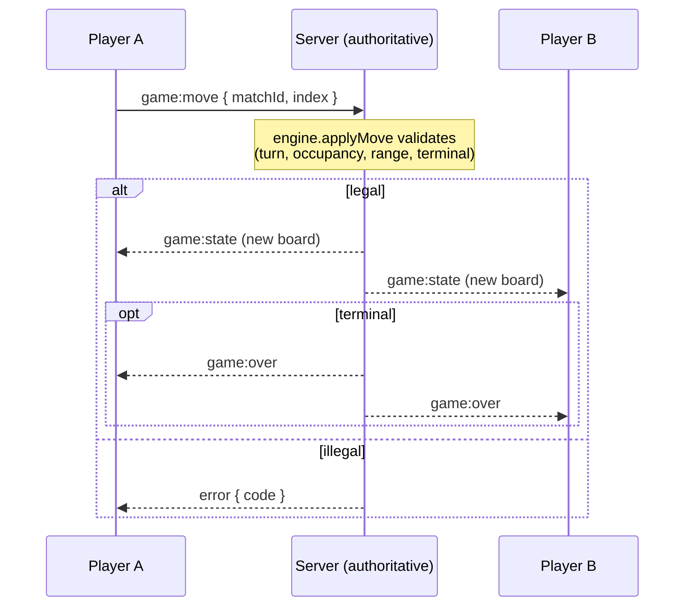
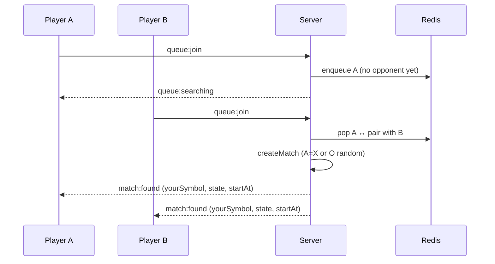
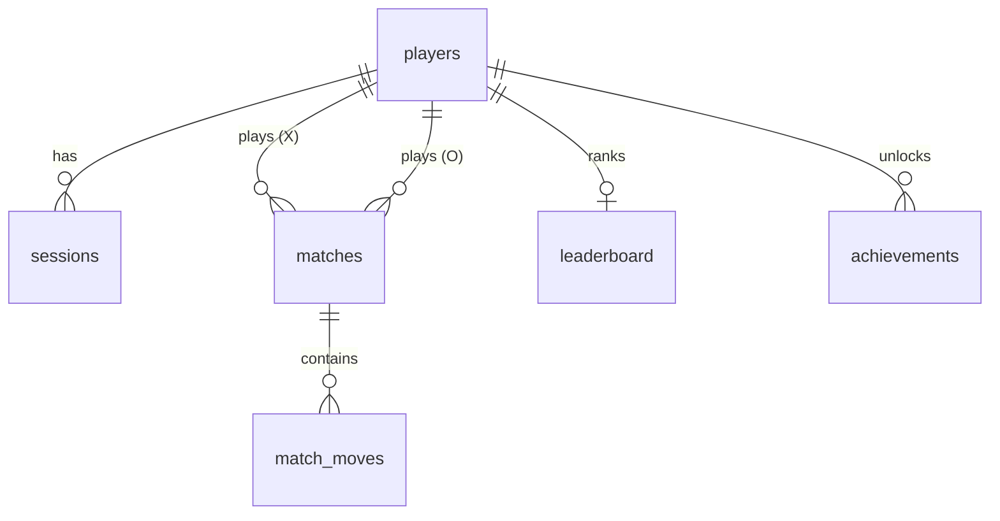

# OX Arena — Architecture

## Overview

OX Arena is a real-time multiplayer game with an **authoritative server**: the
backend owns all game state and validates every action; clients render state and
send intents. This prevents cheating and keeps two devices perfectly in sync.



## Backend layers

| Layer | Responsibility | Key files |
|-------|----------------|-----------|
| Transport | HTTP + WebSocket, CORS, secure headers | `src/app.ts`, `src/index.ts` |
| Auth | Anonymous JWT sessions | `src/auth/session.ts` |
| Matchmaking | Redis-backed queue, pairing, duplicate prevention | `src/matchmaking/queue.ts` |
| Game orchestration | Match lifecycle, persistence, reconnect | `src/game/gameManager.ts`, `src/socket/handlers.ts` |
| Rules (pure) | Move validation, win/draw — no I/O | `src/game/engine.ts` |
| Persistence | Postgres pool + schema | `src/db/*` |
| State cache | Redis client (+ in-memory dev shim) | `src/redis/client.ts` |

The **engine is pure and side-effect free**, so it is exhaustively unit-tested and
can later run on the client for prediction without code duplication.

## Android layers (Clean Architecture / MVVM)

```
ui/         Compose screens + one GameFlowViewModel (StateFlow-driven)
  ↑ depends on
domain/     Models + MultiplayerClient interface (no Android/Socket types)
  ↑ implemented by
data/       SocketMultiplayerClient (Socket.IO), DTO mapping, token store
```

Dependencies point inward (ui → domain ← data). The UI never imports Socket.IO;
it depends only on the `MultiplayerClient` interface, bound to the concrete
implementation by Hilt. A single `ClientState` StateFlow is the source of truth,
so navigation and rendering are derived rather than imperatively juggled.

## Realtime protocol

See [`API.md`](API.md) for the full event catalogue. The core loop:



## Matchmaking flow



## Data model



Full DDL (including roadmap tables) is in `backend/src/db/schema.sql`.

## Scaling (roadmap)

This slice runs authoritatively on a **single instance** — active game state lives
in memory on the instance that created the match. To scale horizontally:

1. Add the **Socket.IO Redis adapter** so rooms span instances.
2. Move active game state into **Redis** (keyed by matchId) so any instance can
   process a move; guard with a per-match distributed lock.
3. Make matchmaking pop-pairing atomic across instances with a **Lua script** on
   the Redis queue (the queue structure is already Redis-native).
4. Run behind Render's load balancer with sticky sessions for the WS upgrade.

The matchmaking queue and presence already live in Redis, so steps 1–3 are additive.

## Deferred features (documented, not stubbed)

| Feature | Where it hooks in |
|---------|-------------------|
| Voice chat (WebRTC/SFU) | New `voice/` service; `voice_sessions` table exists; UI slot on Match-Found screen |
| Advanced game modes | `engine.ts` already generic over board size / win-length; add mechanics per mode |
| Anti-cheat hardening | Server already authoritative; add rate limiting, move-timing analysis on `match_moves` |
| Ranked / XP economy | `leaderboard`, `statistics`, `achievements` tables exist; wire into `gameManager` on match end |
| Prediction / interpolation | Reuse pure `engine.ts` client-side for optimistic moves |
| Load / stress tests | k6/artillery against the Socket.IO endpoint |
